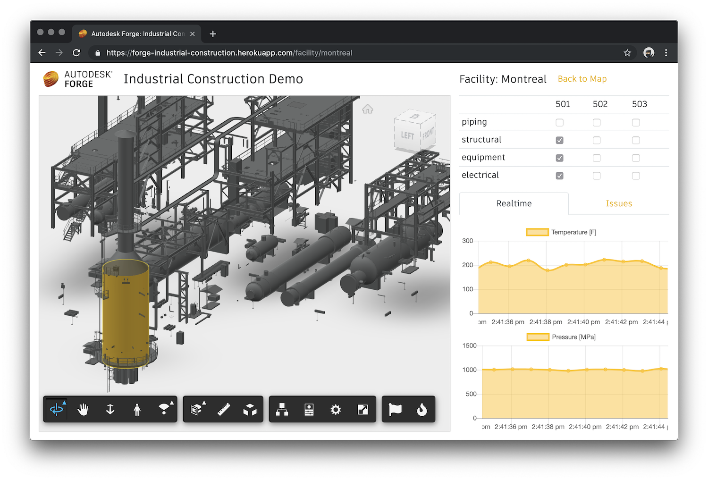

# Forge Use Case Demo: Industrial Construction


[](http://forge.autodesk.com/en/docs/viewer/v6)
[](https://forge.autodesk.com/en/docs/data/v2)
[](https://forge.autodesk.com/en/docs/model-derivative/v2)

Autodesk Forge sample application demonstrating features relevant to the area of industrial construction.



## Live demo

Master branch is deployed to https://forge-industrial-construction.herokuapp.com.

## Development

### Prerequisites

- Node.js v10+
- [Forge](https://forge.autodesk.com) application credentials
- MongoDB database
  - for example, using the free tier of [MongoDB Atlas](https://www.mongodb.com/cloud/atlas)
  - or running MongoDB locally: https://docs.mongodb.com/manual/installation

### Setup & Running

- clone this repository
- install dependencies: `npm install`
- run server with all the required env. variables
  - for example, on macOS:
    ```bash
    export FORGE_CLIENT_ID=<client-id>
    export FORGE_CLIENT_SECRET=<client-secret>
    export FORGE_BUCKET=<bucket-name>
    export GOOGLE_MAPS_API_KEY=<api-key>
    export MONGODB_URL=<mongodb-connection-string>
    npm start
    ```
  - or, when using [Visual Studio Code](https://code.visualstudio.com), add this configuration to your _.vscode/launch.json_:
  ```json
        {
            "type": "node",
            "request": "launch",
            "name": "Launch Express Server",
            "program": "${workspaceFolder}/server.js",
            "env": {
                "FORGE_CLIENT_ID": "<client-id>",
                "FORGE_CLIENT_SECRET": "<client-secret>",
                "FORGE_BUCKET": "<bucket-name>",
                "GOOGLE_MAPS_API_KEY": "<api-key>",
                "MONGODB_URL": "<mongodb-connection-string>"
            }
        }
  ```
- go to http://localhost:3000

### Deployment

[](https://heroku.com/deploy)

## License

This sample is licensed under the terms of the [MIT License](https://tldrlegal.com/license/mit-license).

## Written by

Petr Broz ([@ipetrbroz](https://twitter.com/ipetrbroz)), Forge Partner Development Group
